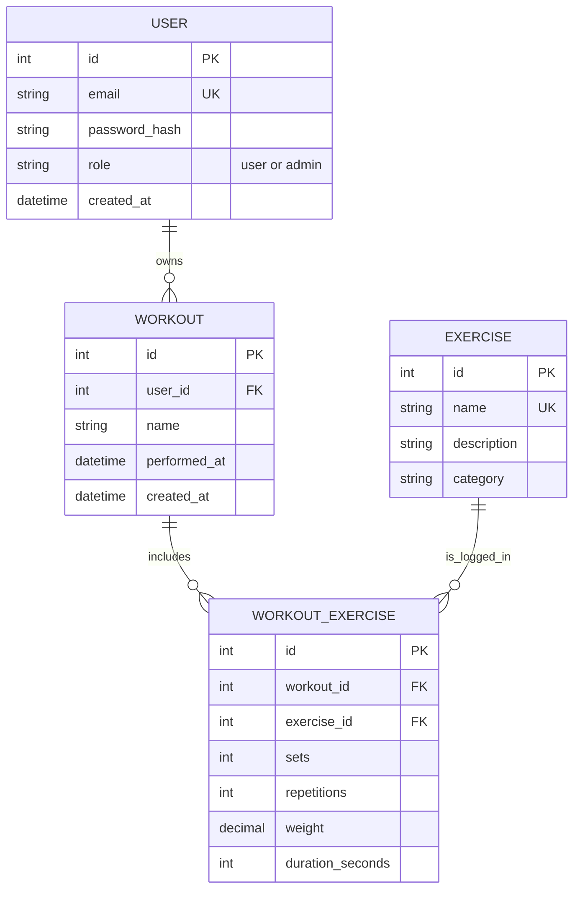

# <API name> Proposal

## 1. The pitch (one paragraph)
The FitTrack API can be used as a catalog for different workouts. The FitTrack API will be able to fetch workouts along with
adding and removing workouts. The API will come with separated User and Admin functionality. Admins will be able to create new workouts,
create new users, promote users to admin, remove workouts, and view users. Users will be able to list favorite workouts, list a
catalog of workouts, create a workout  session, and edit workout session.

## 2. Resources
| Resource | Key fields | Relationships             |
|--|---|---------------------------|
| User | id, displayName, password, role | a User has many Workouts  |
| Admin | id, displayName, passowrd, role | An Admin should have many Workouts and should be able to edit users |
| Workout | id, name, description, sets, reps | a User and admin should have many Workouts |

## 3. ER sketch
Tables, primary and foreign keys, and cardinality. Edit this Mermaid diagram (it renders on GitHub;
try changes at https://mermaid.live):

## 4. Endpoints
| Verb | Path | Auth | Purpose |
|---|---|---|---|
| GET | /api/v1/fittrack/workouts?page=0&size=20 | user | list my workouts (paginated) |
| POST | /api/v1/fittrack/workouts | user | create a workout |
| GET | /api/v1/fittrack/exercises?page=0&size=20 | public | browse exercises (paginated) |
| POST | /api/v1/fittrack/exercises | admin | add an exercise |
| DELETE | /api/v1/fittrack/exercises | admin | remove an exercise |
| PATCH | /api/v1/fittrack/exercises/description | admin | update an exercise's description |
| PUT | /api/v1/fittrack/exercises | admin | replace an exercise |
| PATCH | /api/v1/fittrack/workouts | user | edit the user's workout |
| DELETE | /api/v1/fittrack/workouts | user | remove a workout from the user's list |
| GET | /api/v1/fittrack/users?page=0&size=20 | admin | list users (paginated) |
| DELETE | /api/v1/fittrack/users | admin | remove a user |
| PATCH | /api/v1/fittrack/users | admin | grant admin privileges |

The exercise and user collection endpoints paginate with `page` and `size`. Exercise
listing will support filtering and sorting; proposed filters include `muscleGroup`,
`type`, `difficulty`, and `equipment`, with sorting controlled by a `sort` parameter.
Mark each endpoint `public`, `user`, or `admin`. Mark which collection paginates and which
filters or sorts.

## 5. Technical choices
- **Database host:** Supabase. We chose Supabase for our workout-tracker school project because it provides a free managed PostgreSQL database, a browser dashboard for team collaboration, and optional user authentication. It allows us to focus on developing our own API, workout scheduling features, and data-validation logic while using an industry-relevant PostgreSQL backend.
- **OAuth2 provider:** We will use Google OAuth 2.0 through Supabase Auth because it gives users a familiar, secure sign-in method without requiring our team to manage passwords. Supabase manages the OAuth redirect and user session, while our API verifies the authenticated user and restricts workout data to its owner. We will use the Authorization Code flow with PKCE for secure authentication.
- **Repo layout:** Split repo so it's easier for our team to stay organized.
These become your ADRs later.

## 6. Risks
The two things most likely to go wrong, and what you will do first to find out.
1 - poor exception handling
well check this by testing each error message
2 - using the wrong endpoint
well check this by making sure each endpoint has a test
## 7. Team and Sprint 1
Who owns what in Sprint 1. Link your Project board and Sprint 1 milestone.
Project board - 
sprint 1 - https://github.com/MaldonadoJack/CST438-Project2-API/milestone/1